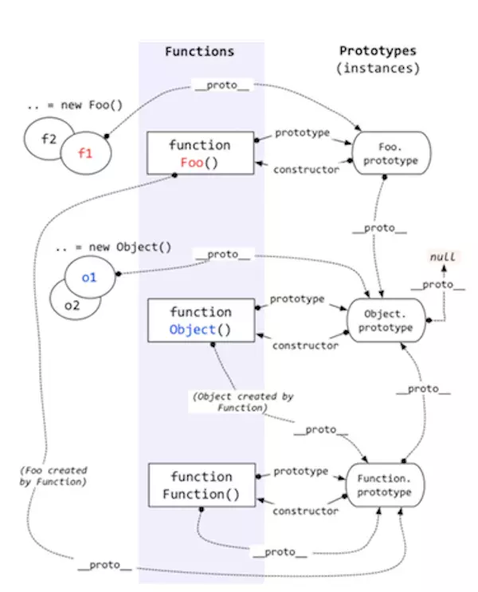

# [返回主页](https://github.com/evenMai92/front-end-interview/blob/master/README.md)

<b><details><summary>1. Object.__proto__值为什么?</summary></b>
答案：

Object.__proto__ = Function.prototype;



公司：字节跳动
</details>

<b><details><summary>2. js数组方法有哪些，可以分为几类，es6新增哪些方法?</summary></b>
答案：

1. 改变原始数组
* push()
* pop()
* shift()
* unshift()
* splice()
* sort()
* reverse()
* forEach()
* copyWithin(es6新增)
* fill(es6新增)

2. 不改变原始数组
* filter()
* concat() 
* slice()
* map()
* some()
* every()
* reduce()
* reduceRight()
* find()与findIndex()(es6新增)
* includes(es7新增)

3. 生成数组
* Array.of方法创建数组(es6新增)
* Array.from方法创建数组(es6新增)

[详解](https://www.cnblogs.com/xzsty/p/10304649.html)

公司：字节跳动，搜狐
</details>

<b><details><summary>3. canvas与svg的区别?</summary></b>
答案：

* SVG 是一种使用 XML 描述 2D 图形的语言。
* SVG 基于 XML，这意味着 SVG DOM 中的每个元素都是可用的。您可以为某个元素附加 JavaScript 事件处理器。
* 在 SVG 中，每个被绘制的图形均被视为对象。如果 SVG 对象的属性发生变化，那么浏览器能够自动重现图形。

* Canvas 通过 JavaScript 来绘制 2D 图形。
* Canvas 是逐像素进行渲染的。
* 在 canvas 中，一旦图形被绘制完成，它就不会继续得到浏览器的关注。如果其位置发生变化，那么整个场景也需要重新绘制，包括任何或许已被图形覆盖的对象。

公司：金蝶科技
</details>

<b><details><summary>4. 事件循环</summary></b>
答案：
1. 所有的任务可以分为同步任务和异步任务，同步和异步任务分别进入不同的执行环境，同步的进入主线程，即主执行栈，异步的进入 Event Queue 。主线程内的任务执行完毕为空，会去 Event Queue 读取对应的任务，推入主线程执行。 上述过程的不断重复就是我们说的 Event Loop (事件循环)。

2. (macro)task 主要包含：script( 整体代码)、setTimeout、setInterval、I/O、UI 交互事件、setImmediate(Node.js 环境)

3. microtask主要包含：Promise、MutaionObserver、process.nextTick(Node.js 环境)，Object.observe

[详解](https://segmentfault.com/a/1190000012925872#articleHeader17)

公司：金蝶科技
</details>

<b><details><summary>5. setTimeout和requestAnimationFrame的区别?</summary></b>
答案：
1. setTimeout
* 间隔时间不精确，可能被阻塞。计时器的间隔指的是将回调函数推入任务队列的间隔时间，任务队列中的任务只有在主线程任务执行完毕后才会被执行。
* 计时器动画的间隔时间如果设定过短就会出现过度渲染占用大量资源，如果设定过长就会影响动画的流畅度。只能够估计合适的时间间隔。
* 多数浏览器对于计时器动画没有优化。
2. requestAnimationFrame
* requestAnimationFrame 动画的帧数是由系统根据当前页面是否可见，CPU 的占用情况等等来决定的，可以最大化地利用系统性能。
* 浏览器对 requestAnimationFrame 动画进行了优化。

[详解](https://segmentfault.com/a/1190000021927175)
公司：金蝶科技
</details>

<b><details><summary>6. 客户端有哪些方法读取到blob数据?</summary></b>
答案：
```javascript
FileReader.readAsArrayBuffer()
开始读取指定的 Blob中的内容, 一旦完成, result 属性中保存的将是被读取文件的 ArrayBuffer 数据对象.
FileReader.readAsBinaryString() 
开始读取指定的Blob中的内容。一旦完成，result属性中将包含所读取文件的原始二进制数据。
FileReader.readAsDataURL()
开始读取指定的Blob中的内容。一旦完成，result属性中将包含一个data: URL格式的Base64字符串以表示所读取文件的内容。
FileReader.readAsText()
开始读取指定的Blob中的内容。一旦完成，result属性中将包含一个字符串以表示所读取的文件内容。
```
公司：金蝶科技
</details>

<b><details><summary>7. 跨域解决方案?</summary></b>
答案：
* 通过jsonp跨域
* document.domain + iframe跨域
* location.hash + iframe
* window.name + iframe跨域
* postMessage跨域
* 跨域资源共享（CORS）
* nginx代理跨域
* nodejs中间件代理跨域
* WebSocket协议跨域

[详解](http://www.imooc.com/article/291931)

公司：金蝶科技,顺丰科技
</details>

<b><details><summary>8. cookie,sessionStorage,localStorage的区别?</summary></b>
答案：


[详解](https://www.jianshu.com/p/bf94eecc9ede)

公司：金蝶科技
</details>

<b><details><summary>9. 深拷贝对象(递归拷贝怎么避免循环引用)?</summary></b>
答案：
[详解](https://www.jianshu.com/p/b08bc61714c7)

公司：腾讯
</details>

<b><details><summary>10. js垃圾回收机制</summary></b>
答案：
[详解](https://segmentfault.com/a/1190000018605776?utm_source=tag-newest)

公司：腾讯
</details>

<b><details><summary>11. 什么是原型和原型链?</summary></b>
答案：
[详解](https://www.jianshu.com/p/5e62dc7349e9)

公司：顺丰科技
</details>

<b><details><summary>12. js实现继承有哪些，最好的是哪个(寄生组合继承)?</summary></b>
答案：
[详解](https://www.cnblogs.com/Leophen/p/11401734.html)

公司：顺丰科技，字节跳动
</details>

<b><details><summary>13. 正则非贪婪模式怎么写?</summary></b>
答案：
```javascript
// 默认贪婪 ["ass", "111", "2"]
'ass1112'.match(/\w{1,3}/g)

// 非贪婪 ["a", "s", "s", "1", "1", "1", "2"]
'ass1112'.match(/\w{1,3}?/g)
```
公司：腾讯
</details>

<b><details><summary>14. 普通函数与箭头函数的区别?</summary></b>
答案：
* 箭头函数是匿名函数，不能作为构造函数，不能使用new；
* 箭头函数不绑定arguments，取而代之用rest参数...解决；
* this的作用域不同，箭头函数不绑定this，会捕获其所在的上下文的this值，作为自己的this值；
* 箭头函数没有原型属性；
* 箭头函数不能当做Generator函数,不能使用yield关键字；

[详解](https://www.softwhy.com/article-9330-1.html)

公司：腾讯
</details>

<b><details><summary>15. async/await与generator的关系?</summary></b>
答案：
[详解](https://segmentfault.com/a/1190000022270916)

公司：腾讯
</details>

<b><details><summary>16. axios原理，以及ajax和fetch的区别?</summary></b>
答案：
```javascript
// 适配器，客户端用xhr,服务端用http
function getDefaultAdapter() {
  var adapter;
  if (typeof XMLHttpRequest !== 'undefined') {
    // For browsers use XHR adapter
    adapter = require('./adapters/xhr');
  } else if (typeof process !== 'undefined') {
    // For node use HTTP adapter
    adapter = require('./adapters/http');
  }
  return adapter;
}
```

1. fetch
* fetch是基于promise实现的，也可以结合async/await。
* fetch请求默认是不带cookie的，需要设置fetch（URL，{credentials:’include’})。
Credentials有三种参数：same-origin，include，*
* 服务器返回400 500 状态码时并不会reject，只有网络出错导致请求不能完成时，fetch才会被reject。
* 所有版本的 IE 均不支持原生 Fetch。
* fetch是widow的一个方法；
* fetch不支持abort，不支持超时控制，使用setTimeout及Promise.reject的实现的超时控制并不能阻止请求过程继续在后台运行，造成了量的浪费
* fetch没有办法原生监测请求的进度
2. ajax
* 是XMLHTTPRequest的一个实例；
* 只有当状态为200或者304时才会请求成功;
* 支持abort,支持超时控制，还可以监听请求的进度；

公司：金蝶科技
</details>

<b><details><summary>17. 单元测试工具jest原理是什么？怎么计算覆盖率？</summary></b>
答案：

公司：腾讯
</details>

<b><details><summary>18. ts相比js最重要的特性？</summary></b>
答案：静态类型分析

公司：有赞云
</details>

<b><details><summary>19. JavaScript异步加载的几种方式？</summary></b>
答案： 

[详解](https://blog.csdn.net/zhouziyu2011/article/details/60149590)

公司：字节跳动
</details>

<b><details><summary>20. 查找需要性能优化的代码段，以及老版本浏览器查找要优化的代码段？</summary></b>
答案： 

公司：腾讯
</details>

<b><details><summary>21. 前端代码线上环境运行状态监控?</summary></b>
答案： sentry.io

公司：腾讯
</details>