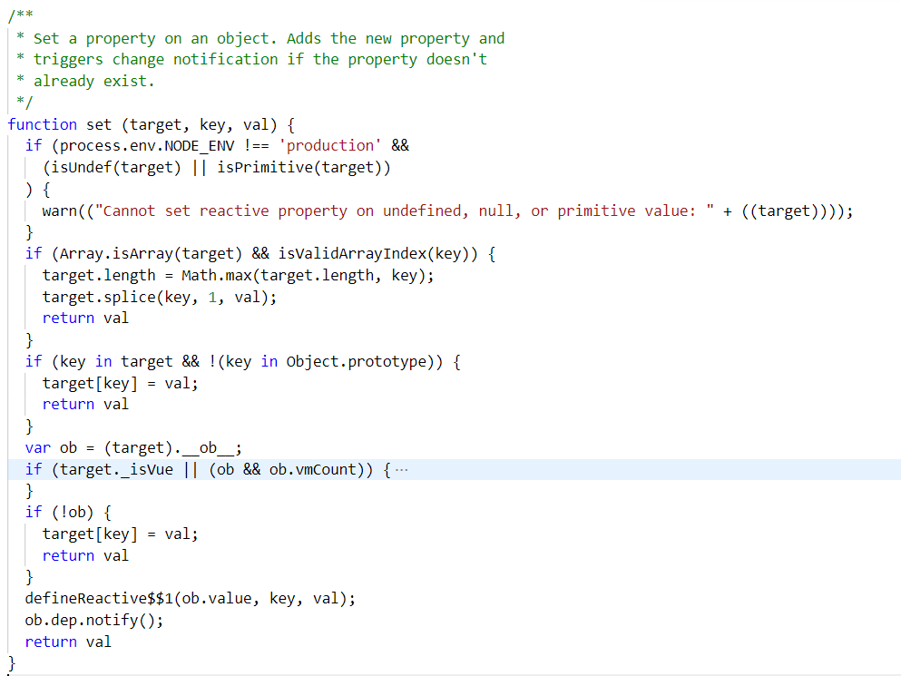
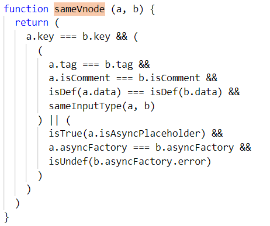

# [返回主页](https://github.com/evenMai92/front-end-interview/blob/master/README.md)

<b>

1. Vue的实例和组件为什么data书写不一样
</b>
答案：

1. 如果两个实例引用同一个对象，当其中一个实例的属性发生改变时，另一个实例属性也随之改变，只有当两个实例拥有自己的作用域时，才不会相互干扰.

2. 组建中的data写成一个函数，数据以函数返回值的形式定义，这样每次复用组件的时候，都会返回一份新的data，相当于每个组件实例都有自己私有的数据空间，它们只负责各自维护的数据，不会造成混乱

公司：字节跳动

<b>

2. vue新增属性怎么变响应式，为什么?
</b>
答案：

1. 调用全局方法Vue.set(target, key, val)或者实例方法vm.$set(target, key, val)都可以将新增属性或者对数组下标设置成响应式；

2. 原理：对于数组，调用splice方法；对于对象调用defineReactive方法设置响应式，并触发一次更新；

3. vue3.0将数据劫持原理由defineProperty改为Proxy，优化对对象进行递归设置拦截，同时还能监听数组和新增属性变化，唯一不好，就是兼容性问题；

公司：腾讯

<b>

3. Vue的列表渲染为什么加key，以index为key有什么问题?
</b>
答案：

1. diff算法默认使用“就地复用”的策略（用index作为key和不加key是一样的，都采用“就地复用”的策略）

2. “就地复用”的策略，只适用于不依赖子组件状态或临时 DOM 状态 (例如：表单输入值) 的列表渲染输出;

3. 将与元素唯一对应的值作为key，可以最大化利用dom节点，提升性能

公司：字节跳动、腾讯

<b>

4. vue为什么用vdom，vdom一定会提升性能吗，vue为什么要使用它?
</b>
答案：

Vue 之所以引入了 Virtual DOM，更重要的原因是为了解耦 HTML 依赖，这带来两个非常重要的好处是：
1. 不再依赖 HTML 解析器进行模版解析，可以进行更多的 AOT 工作提高运行时效率：通过模版 AOT 编译，Vue 的运行时体积可以进一步压缩，运行时效率可以进一步提升；

2. 可以渲染到 DOM 以外的平台，实现 SSR、同构渲染这些高级特性，Weex 等框架应用的就是这一特性。

[尤大大回答](https://www.zhihu.com/question/31809713/answer/53544875)

公司：金蝶科技

<b>

5. vue3.0做了那些优化改进？
</b>
答案：

1. 更快
- 虚拟DOM重写
- 优化slots的生成
- 静态树提升
- 静态属性提升
- 基于Proxy的响应式系统

2. 更小：
- 通过摇树优化核心库体积

3. 更容易维护：
- TypeScript + 模块化

4. 更加友好
- 跨平台：编译器核心和运行时核心与平台无关，使得Vue更容易与任何平台（Web、Android、iOS）一起使用

5. 更容易使用
- 改进的TypeScript支持，编辑器能提供强有力的类型检查和错误及警告

公司：金蝶科技

<b>

6. vue父子组件的通讯方式有哪些？
</b>
答案：

1. props;
2. $emit;
3. 属性$attrs 和 $listeners;
4. provide / inject;
5. EventBus;
6. $parent;
7. Vuex;

公司：金蝶科技、微众

<b>

7. vue非父子组件的通讯方式有哪些？
</b>
答案：

1. EventBus;
2. Vuex;

公司：腾讯

